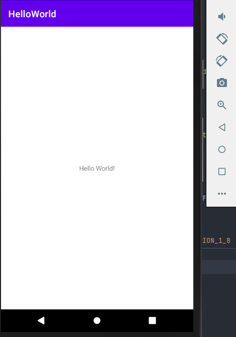

# Hello World - Android

## 목표

-  강의 : https://developer.android.com/codelabs/kotlin-android-training-get-started#0

-  Android studio 를 통해 Hello World 앱 만들어보기

-  Kotlin 사용

## Android src 설명(간단하게라도 알아보고 가자!)

1. 프로젝트 src 보는 방식 설정(기본값 : Android)

2. 앱의 모든 코드와 리소스가 들어있다.

3. Android 시스템에서 앱에 대한 필수적인 정보를 제공하는 파일이 포함되어 있다.

4. Android 앱의 모든 주요 Kotlin 코드가 포함되어 있다. Kotlin 코드가 java 폴더에 작성되는 규칙으로 인해 JAVA 프로그래밍 언어로 작성된 코드와도 원활하게 동작할 수 있다.

5. 앱에서 사용되는 정적 콘텐츠가 들어가있다.

6. 프로젝트에서 사용되는 모듈과 일반적인 구성 옵션이 포함되어있다.

7. 모듈 수준의 build.gradle 에는 각 모듈에 대한 빌드 설정을 변경할 수 있다. 예를 들어, 앱이 지원하는 api level를 변경하거나 새로운 section, dependencies 를 선언 및 변경할 수 있다.

## 결과

[Real Device] - Galaxy S9 (API LEVEL 29)

[Virtual Device] - Nexus 5X (API LEVEL 30)

## 간단 코딩챌린지

1. Hello World! 을 Happy Birthday to Kyeongmin King! 으로 변경

   [결과 - virtual device] - Nexus 5X (API LEVEL 30)

   

2. 상단 바에 "HelloWorld" 를 "My Dice Roller" 로 변경

   [결과 - virtual device] - Nexus 5X (API LEVEL 30)

   
